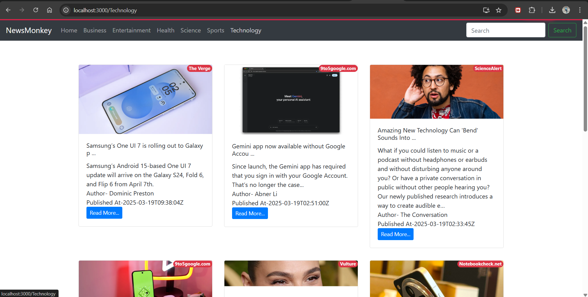

# Getting Started with Create React App

This project was bootstrapped with [Create React App](https://github.com/facebook/create-react-app).

## Get this code locally

```shell
git clone https://github.com/KrishnaGupta0405/NewsMonkey
cd .\NewsMonkey
```
```
npm i
npm run start
```

## Screenshot of the project


### Note
- The project make uses of Babel compiler, hence it will take huge!! time to load, so please have patience